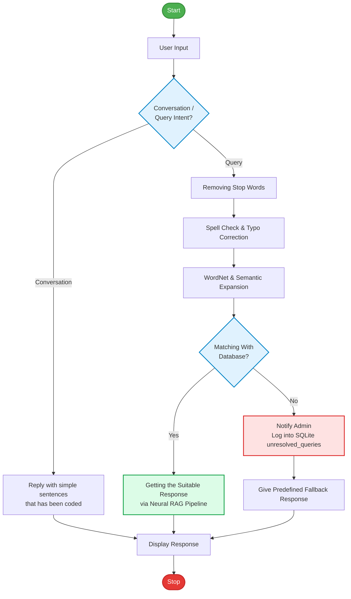

# 🏛️ CHARUSAT University AI Assistant: Architecture & Flowchart

This document details the end-to-end operational flowchart, NLP pipeline, and system architecture for the **CHARUSAT Virtual Intelligence AI Assistant**.

---

## 📊 1. University Chatbot Flowchart

---

## 📖 2. The Dictionary: Core Concepts Explained

### 1. **User Input & Intent Router (`Conversation` vs `Query`)**
* **Purpose**: Classifies whether the incoming message is a casual pleasantry (*"Hello"*, *"Good morning"*, *"Kem cho"*, *"Thank you"*) or an informational university inquiry (*"What are the cutoff marks for CSPIT CE?"*).
* **Implementation in Code**: `rag/pipeline.py -> classify_intent()`
* **Benefit**: Greetings execute in sub-millisecond time ($< 0.001s$) without triggering expensive database lookups.

---

### 2. **Removing Stop Words**
* **Purpose**: Filters out common filler words (*"a"*, *"an"*, *"the"*, *"is"*, *"in"*) from the search tokens while preserving domain keywords, course abbreviations (*"CE"*, *"IT"*, *"AI & ML"*), and numbers (*"300 seats"*, *"105k books"*).
* **Implementation in Code**: `rag/pipeline.py -> preprocess_nlp_query()`

---

### 3. **Spell Check & Typo Correction**
* **Purpose**: Automatically fixes common user typos and spelling mistakes before searching the knowledge base:
  * `cspitt` / `spit` ➔ **CSPIT**
  * `depstarr` ➔ **DEPSTAR**
  * `charust` ➔ **CHARUSAT**
  * `admisn` ➔ **Admission**
  * `hostle` ➔ **Hostel**
  * `cutof` ➔ **Cutoff**
* **Implementation in Code**: `rag/pipeline.py -> typo_dict` regex replacement.

---

### 4. **WordNet & Semantic Expansion**
* **Purpose**: Enriches user keywords with relevant synonyms and conceptual associations:
  * *"books"* ➔ Expands to `library catalogue Koha OPAC shelf copies`
  * *"fees"* ➔ Expands to `tuition fees hostel bus mess charges`
  * *"admissions"* ➔ Expands to `ACPC merit GUJCET JEE admission cutoff eligibility`
* **Implementation in Code**: `rag/pipeline.py -> expansion_dict`

---

### 5. **Matching With Database (`Yes` vs `No`)**
* **Hybrid Search (Dense Vector + BM25 Lexical Keyword Matching)**:
  * **ChromaDB Vector Store**: Semantic cosine similarity for understanding conceptual questions.
  * **In-Memory Keyword Matcher**: Exact term matching for course codes (`CE204`), faculty names, and library shelf IDs (`CS-04B`).
* **Implementation in Code**: `rag/pipeline.py -> retrieve_context()` & `database/vector_store.py`

---

### 6. **Notify Admin (Unresolved Queries)**
* **Purpose**: When a student asks a valid question that has no matching document in the database (or out of scope), the system automatically logs the query into an administrative audit table in SQLite (`admin_notifications`).
* **Why this is essential**:
  1. Alerts the university web team about missing information students are actively looking for.
  2. Enables continuous knowledge base expansion without guesswork.
* **Implementation in Code**:
  * `database/db_client.py -> notify_admin(query, reason)`
  * `GET /api/v1/admin/unresolved` (Admin review API endpoint).

---

### 7. **Getting the Suitable Response & Display**
* **Neural Generation**: Gemini 3.5 Flash-Lite / Fast Synthesizer generates structured responses with Markdown, tables, and bullet lists.
* **Natural Script Mirroring**: Automatically matches the user's language and script:
  * **Gujlish** (e.g. *"cspit ma kaya dept che?"*) ➔ Responds in conversational Gujlish.
  * **Hinglish** (e.g. *"depstar me kitni seats hai?"*) ➔ Responds in conversational Hinglish.
  * **ગુજરાતી (Gujarati script)** ➔ Responds in pure Gujarati.
  * **हिंदी (Hindi script)** ➔ Responds in pure Hindi.
  * **English** ➔ Responds in professional English.

---

## 🗂️ 3. Flowchart to Codebase Directory Mapping

| Flowchart Stage | Code File Location | Function / Method |
| :--- | :--- | :--- |
| **Start / User Input** | [`frontend/app.js`](file:///Users/neev/Documents/CHARUSAT_AI_ASSISTAN/frontend/app.js) | `handleSendMessage()` |
| **Intent Classification** | [`rag/pipeline.py`](file:///Users/neev/Documents/CHARUSAT_AI_ASSISTAN/rag/pipeline.py) | `classify_intent()` |
| **Precoded Conversation Reply** | [`rag/pipeline.py`](file:///Users/neev/Documents/CHARUSAT_AI_ASSISTAN/rag/pipeline.py) | `handle_conversation_intent()` |
| **Stop Words & Spell Check** | [`rag/pipeline.py`](file:///Users/neev/Documents/CHARUSAT_AI_ASSISTAN/rag/pipeline.py) | `preprocess_nlp_query()` |
| **WordNet / Semantic Expansion** | [`rag/pipeline.py`](file:///Users/neev/Documents/CHARUSAT_AI_ASSISTAN/rag/pipeline.py) | `preprocess_nlp_query()` |
| **Database Matching** | [`database/vector_store.py`](file:///Users/neev/Documents/CHARUSAT_AI_ASSISTAN/database/vector_store.py) | `search()`, `retrieve_context()` |
| **Notify Admin** | [`database/db_client.py`](file:///Users/neev/Documents/CHARUSAT_AI_ASSISTAN/database/db_client.py) | `notify_admin()`, `admin_notifications` |
| **Suitable Response Generation** | [`rag/pipeline.py`](file:///Users/neev/Documents/CHARUSAT_AI_ASSISTAN/rag/pipeline.py) | `generate_response()`, `build_prompt()` |
| **Display Response** | [`frontend/app.js`](file:///Users/neev/Documents/CHARUSAT_AI_ASSISTAN/frontend/app.js) | `appendMessage()` |
